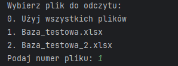
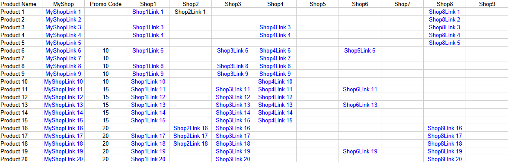
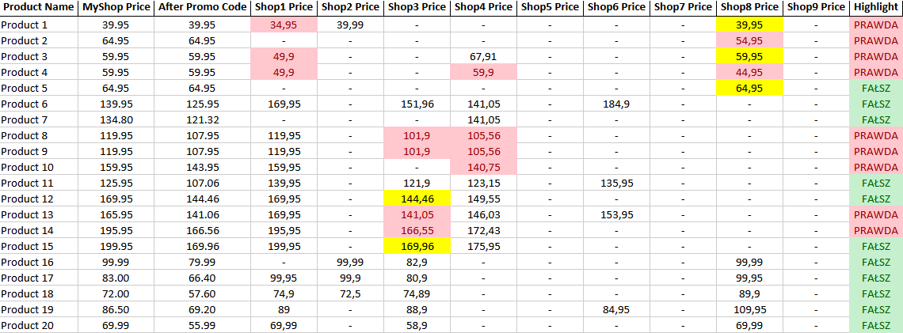

# Program Porównujący Ceny Produktów

## Opis Projektu

Ten projekt to program stworzony w Pythonie, który automatycznie porównuje ceny produktów w Twoim sklepie internetowym z cenami w sklepach konkurencyjnych. Program działa w następujący sposób:
1. Zczytuje linki do produktów z pliku Excel (`.xlsx`).
2. Korzysta z biblioteki Selenium, aby wejść na strony sklepów konkurencyjnych i pobrać ceny produktów.
3. Uwzględnia kody promocyjne, które można zastosować w Twoim sklepie.
4. Porównuje ceny i zaznacza produkty, których ceny są niższe lub takie same jak w Twoim sklepie.
5. Zapisuje wyniki do nowego pliku Excel.

## Instrukcja Użycia

### Krok 1: Wybór Pliku

Po uruchomieniu skryptu, zobaczysz listę plików `.xlsx` w bieżącym katalogu. Wybierz plik, z którego chcesz odczytać dane, wpisując odpowiedni numer:

### Krok 2: Zaczytanie Linków

Program odczytuje linki do produktów z wybranego pliku Excel. Plik powinien zawierać kolumnę z nazwami produktów nazwaną "Product Name", kolumny z nazwami sklepów i kolumnę "Promo Code". Oto przykład jak powinno to wyglądać:

### Krok 3: Pobieranie Ceny

Program korzysta z biblioteki Selenium, aby wejść na strony sklepów konkurencyjnych i pobrać ceny produktów. Na tym etapie program automatycznie przechodzi przez każdą stronę i pobiera cenę zgodnie z zadanym XPath.

### Krok 4: Porównanie Ceny

Program porównuje ceny pobrane ze stron konkurencyjnych z ceną Twojego sklepu, uwzględniając ewentualny kod promocyjny. Produkty, których ceny są niższe lub takie same jak w Twoim sklepie, zostaną zaznaczone.

### Krok 5: Generowanie Wyników

Wyniki porównania są zapisywane do nowego pliku Excel w folderze `Wyniki`. Plik wynikowy zawiera ceny produktów ze wszystkich sklepów oraz ceny po uwzględnieniu kodu promocyjnego w Twoim sklepie. Produkty, których ceny są niższe lub takie same jak w Twoim sklepie, są odpowiednio zaznaczone.

### Krok 6: Oznaczanie Wyników

Program dodaje kolumnę `Highlight`, która określa, które produkty mają być podświetlone. Komórki z cenami niższymi niż cena Twojego sklepu są oznaczone na czerwono, ceny równe są oznaczone na żółto, a ceny wyższe na zielono.

### Ostrzeżenia i Wskazówki

- Upewnij się, że plik Excel zawiera poprawne nazwy kolumn i linki do produktów.
- Nazwy kolumn w pliku Excel możesz dowolnie zmieniać, ale pamiętaj o zmianie ich nazw również w kodzie.
- W przypadku dużej liczby produktów proces może potrwać dłużej.
- Sprawdź, czy używasz odpowiedniej wersji WebDrivera zgodnej z Twoją przeglądarką.
- W przypadku błędów związanych z Selenium, upewnij się, że przeglądarka i WebDriver są poprawnie skonfigurowane.
- Xpath można łatwo pozyskać przy pomocy czatu GPT, wklejając kawałek kodu html strony zawierający cenę wybranego produktu, najlepiej takiego, który znajduje się na promocji.

