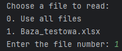
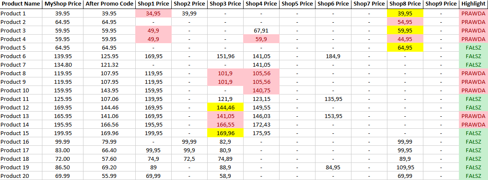

# Product Price Comparison Program

## Project Description

This project is a Python program that automatically compares product prices in your online store with prices in competing stores. The program works as follows:
1. Reads product links from an Excel file (`.xlsx`).
2. Uses the Selenium library to access competing store websites and retrieve product prices.
3. Considers promotional codes that can be applied in your store.
4. Compares prices and highlights products with prices lower or equal to those in your store.
5. Saves the results to a new Excel file.

## Usage Instructions

### Step 1: Select a File

After running the script, you will see a list of `.xlsx` files in the current directory. Choose the file from which you want to read data by entering the corresponding number:

### Step 2: Reading Links

The program reads product links from the selected Excel file. The file should contain a column with product names named "Product Name", columns with store names, and a column named "Promo Code". Here is an example of what it should look like:

### Step 3: Retrieving Prices

The program uses the Selenium library to access competing store websites and retrieve product prices. At this stage, the program automatically navigates through each page and retrieves the price according to the specified XPath.

### Step 4: Price Comparison

The program compares the prices retrieved from competing websites with the price of your store, taking into account any promotional code. Products with prices lower or equal to those in your store are highlighted.

### Step 5: Generating Results

The comparison results are saved to a new Excel file in the `Results` folder. The results file contains product prices from all stores and prices including the promotional code in your store. Products with prices lower or equal to those in your store are appropriately highlighted.

### Step 6: Highlighting Results

The program adds a `Highlight` column that indicates which products should be highlighted. Cells with prices lower than your store's price are marked in red, equal prices in yellow, and higher prices in green.

### Warnings and Tips

- Ensure that the Excel file contains correct column names and product links.
- You can change the column names in the Excel file, but remember to also change their names in the code.
- The process may take longer for a large number of products.
- Make sure you are using the correct version of the WebDriver compatible with your browser.
- In case of Selenium-related errors, ensure that the browser and WebDriver are properly configured.
- You can easily obtain XPath using the GPT chat by pasting a piece of HTML code from the page containing the price of the selected product (preferably one that is on promotion). The `main.py` file contains example XPaths; yours may look different.
